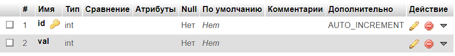

Разработка сервисов
========================
Задание
------------------------
Разработать и реализовать алгоритм внешней сортировки. Данные хранятся на сервере в массиве, сервер предоставляет доступ к отдельным элементам. Клиент поочерёдно запрашивает отдельные ячейки и сортирует массив.

Возможности пользователей:
- сортировка массива

Ход работы
------------------------

- Разработать пользовательский интерфейс
- Описать сценарии работы
- Описать API сервера и хореографию
- Описать структуру БД и алгоритмы обработки данных
- Написать программный код
- Удостовериться в корректности кода

## 1. Пользовательский интерфейс
-Начальные данные


-Отсортированный массив


## 2. Пользовательский сценарий работы
Пользователь попадает на главную страницу **index.php**, нажимает на кнопку **Отсортировать <кол-во элементов>**, массив сортируется и обновляется


## 3. Структура базы данных


- id(INT, AUTO_INCREMENT) -- уникальный индекс элемента
- val(INT) -- значение элемента


## 4. Алгоритм
Клиент запрашивает элементы массива из бд функцией **get** по одному и, сортируя, меняет их значения функцией **set**. За сортировку отвечает функция **bubbleSort**


## 5. Значимые фрагменты кода
- **вывод массива**
```
<div id="insert" class="container">
    <div class="text-center fs-1">Массив</div>
    <?php 
    include('connect.php');
    $res = mysqli_query($link, "SELECT * FROM sort");
    $count = mysqli_num_rows($res);
    $cur = mysqli_fetch_assoc($res);
    while ($cur) {?>
        <div class="row mt-2 justify-content-center">
            <div class="col text-center">
                    <div class="fs-3"> <?=$cur['val']?> </div>
            </div>
        </div>
        <?php
        $cur = mysqli_fetch_assoc($res);
    } 
    ?>
</div>
```
- **bubbleSort**
```
async function bubbleSort(size){
    let i=0;
    let j=0;
    for (let cur = 1; cur < size; cur++) { 
        for (let next = cur + 1; next <= size; next++) {
            i = await get(cur);
            console.log(i);
            j = await get(next);
            console.log(j);
            if (j < i) {
                await set(j,cur);
                await set(i,next);
            }
        }
    }
    window.location.reload();
    return 0;
}
```
- **get**
```
async function get(id){
    let x=0;
    let create_data = new FormData();
    create_data.append('index', id);

    return fetch('http://lab5/_get.php', {method: 'POST', body: create_data})
        .then(resp => resp.text())
        .then(text=>{
            x=Number(text);
            return x;
        });
}
```

- **set**
```
async function set(val, id){
    let create_data = new FormData();
    create_data.append('index', id);
    create_data.append('element', val);

    fetch('http://lab5/_set.php', {method: 'POST', body: create_data})
        .then(resp => resp.text());
    return 0;
}
```
